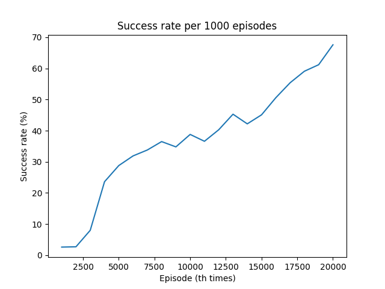

# Q learning in FrozenLake-v0

Example of applying Q-learning to FrozenLake-v0.

## Result

Success rate per 1000 episodes. 
 

## Reference

- [FrozenLake-v0](https://gym.openai.com/envs/FrozenLake-v0/)
